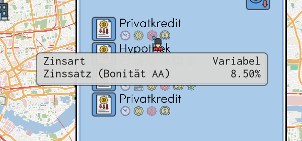
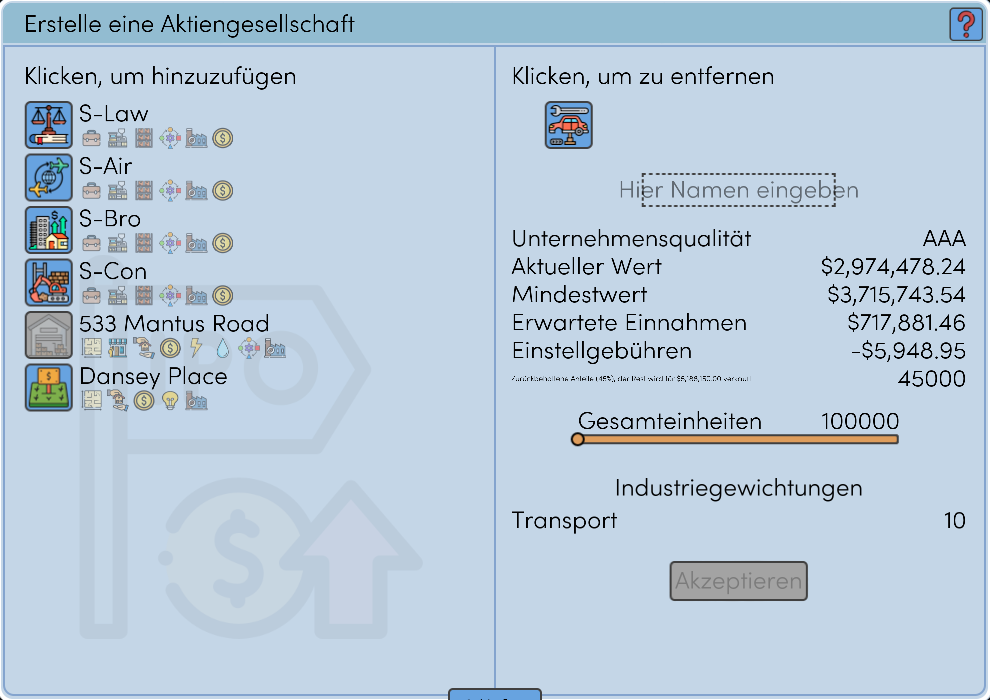
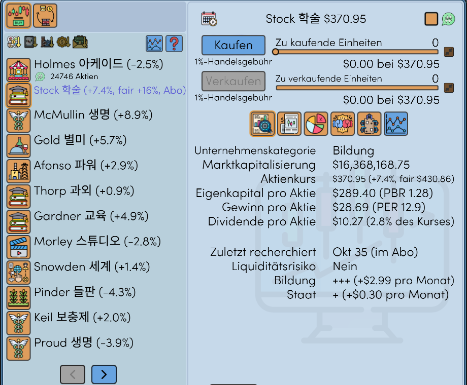
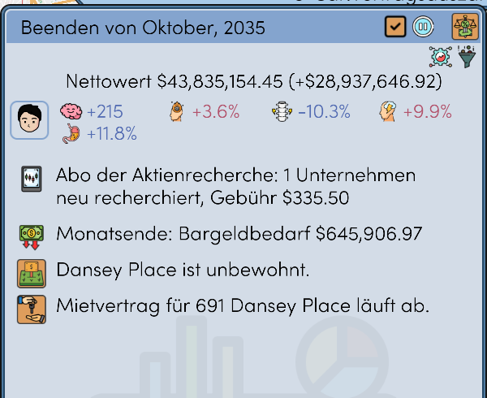
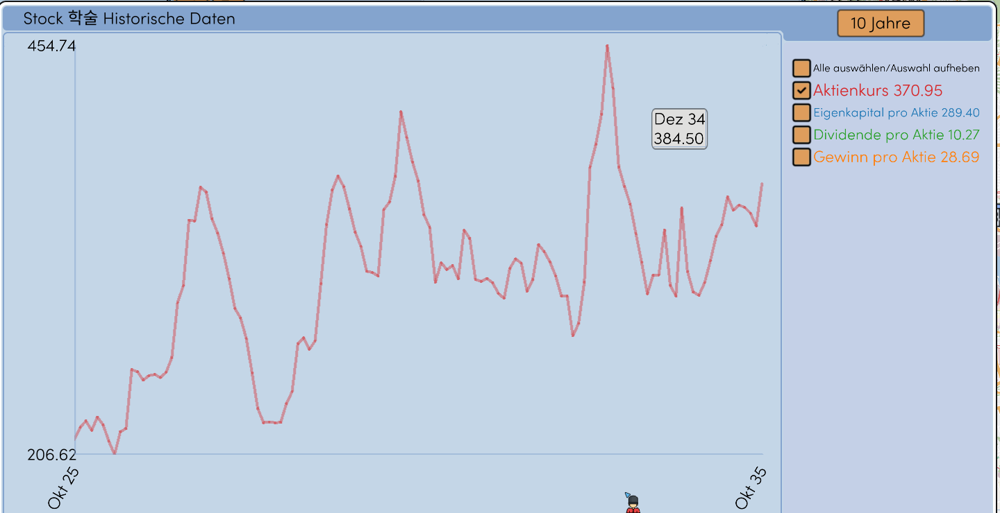
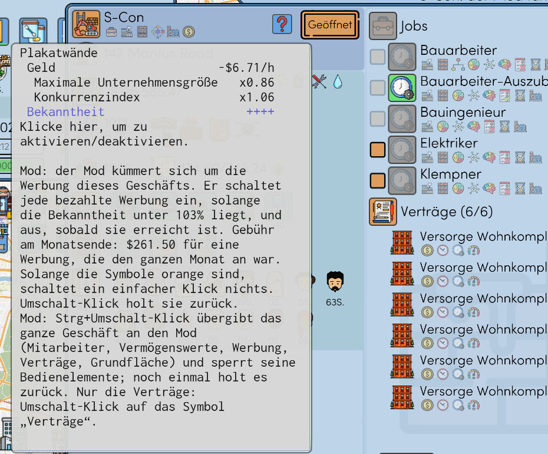
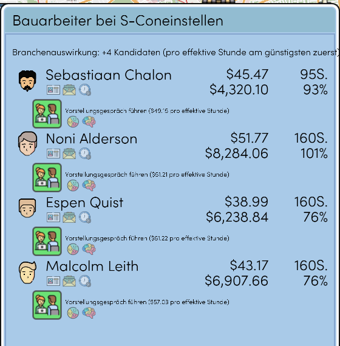

# Realistic Economy

Ein Mod für This Grand Life 2. Nur für die Spielversion v1.03.22, Mod-Version 1.0.0. Nicht vom Entwickler des Spiels.

Andere Sprachen: [English](README.md), [한국어](README.ko.md), [Español](README.es.md), [Français](README.fr.md), [Português (Brasil)](README.pt-BR.md), [日本語](README.ja.md), [简体中文](README.zh-CN.md)

## Kreditzinsen richten sich nach der Bonität

Zins = Zinssatz der Zentralbank + Aufschlag. Die Bonität deines Haushalts (AAA bis B) bestimmt den Aufschlag. Weniger Schulden und mehr Einkommen und Bargeld geben eine bessere Bonität.

## Ein Börsengang bringt Bargeld

Das Spiel gibt dir 25 % der Aktien und kein Bargeld. Mit dem Mod behältst du 45 %, und die anderen 55 % werden zum Ausgabekurs verkauft. Die kleine Zeile unter der Gebühr zeigt dieses Bargeld.

## Aktien: Kennzahlen, Recherche-Abo, Sitze im Direktorium

- Neben dem Aktienkurs: die Änderung zum Vormonat, PBR, PER und Dividendenrendite.
- Ein Umschalt-Klick auf ein Unternehmen abonniert seine Recherche. Der Mod recherchiert es jeden Monat neu, gegen eine Gebühr, und zeigt seinen fairen Kurs. Strg+Umschalt-Klick abonniert alle Unternehmen.
- Je 20 % der Aktien eines börsennotierten Unternehmens ist ein Sitz im Direktorium garantiert. Du nominierst im Monat der Wahl ein Haushaltsmitglied.

Die monatliche Zusammenfassung nennt die Recherche und ihre Gebühr und das Bargeld, das dieses Monatsende kostet.

## Diagramme

Das Diagramm eines Unternehmens öffnet sich nur mit dem Aktienkurs. Jede Linie hat ihre eigene Farbe, und ihr letzter Wert steht neben ihrem Namen. Der Zeitknopf hat jetzt auch sechs Monate.

## Geschäfte automatisieren

Mitarbeiter, Vermögenswerte, Werbung und Verträge lassen sich einzeln an den Mod übergeben, für jedes Geschäft. Ein Strg+Umschalt-Klick auf ein Werbesymbol übergibt alles. Die Hinweistexte der Symbole nennen die Klicks.

Der Reiter zum Einstellen nennt zuerst, wer dieselbe Arbeit günstiger macht (Lohn pro Stunde ÷ Arbeitseffizienz).

## Behobene Fehler des Spiels

- Das Spiel beendete sich nach einigen Dutzend Ladevorgängen
- Falsche Übersetzungen in mehreren Sprachen
- Kästchen statt Buchstaben in Personennamen

## Weitere Funktionen

Jede lässt sich in der Einstellungsdatei abschalten.

- Handelssperre für Aktien und Termingeschäfte nach dem Laden eines früheren Spielstands
- Casino: fester Einsatz und feste Chancen, jedes Spiel einmal im Monat
- Die Kandidaten eines Monats bleiben nach dem Laden dieselben
- Ein Hinweis, wenn eine Immobilie deutlich unter ihrem Wert angeboten wird
- Eine abgeschlossene Ausbildung behält ihren Wert

## Installation

1. Schließe das Spiel.
2. Entpacke die Zip-Datei aus den [Releases](../../releases) in den Spielordner (dort liegt `TGL2.exe`).
3. Starte `RealisticEconomy_install.bat`. Die Datei kopiert zuerst deine Spielstände nach `saves_before_RealisticEconomy_1`.

Zum Entfernen starte `RealisticEconomy_uninstall.bat`. Die Einstellungen stehen in `RealisticEconomy.ini`. Das vollständige Handbuch ist auf Englisch: [docs/RealisticEconomy_README_en.txt](docs/RealisticEconomy_README_en.txt).

Ein Virenscanner kann `version.dll` melden. Das ist der öffentliche Ultimate ASI Loader. Nach einem Update des Spiels schaltet sich der Mod selbst ab.

MIT-Lizenz. Der Quelltext liegt in [src](src).
