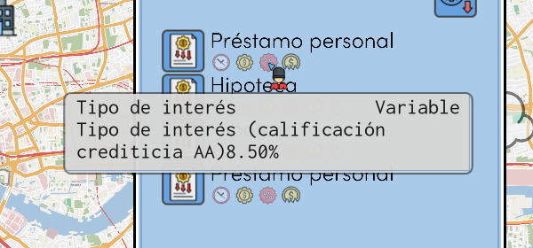
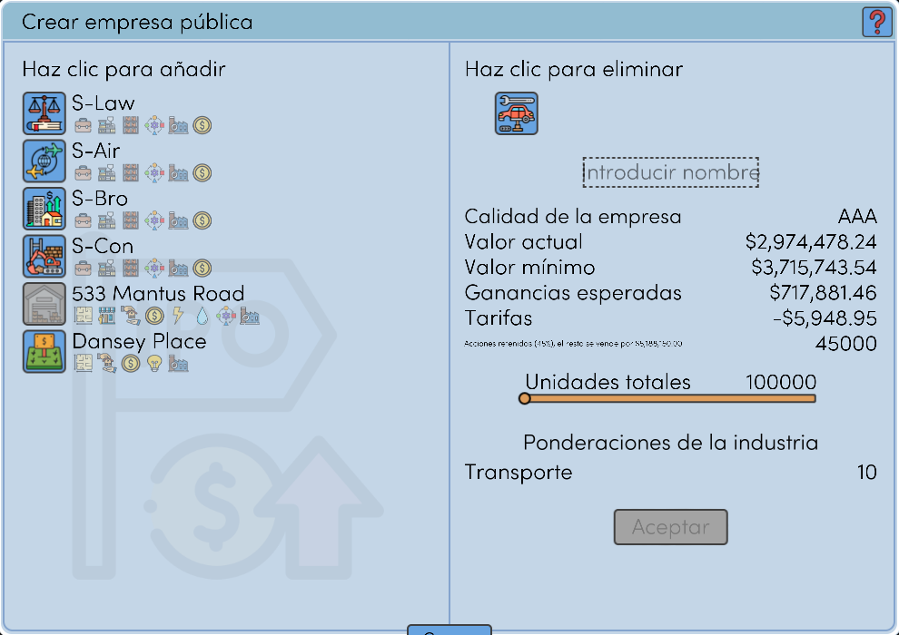
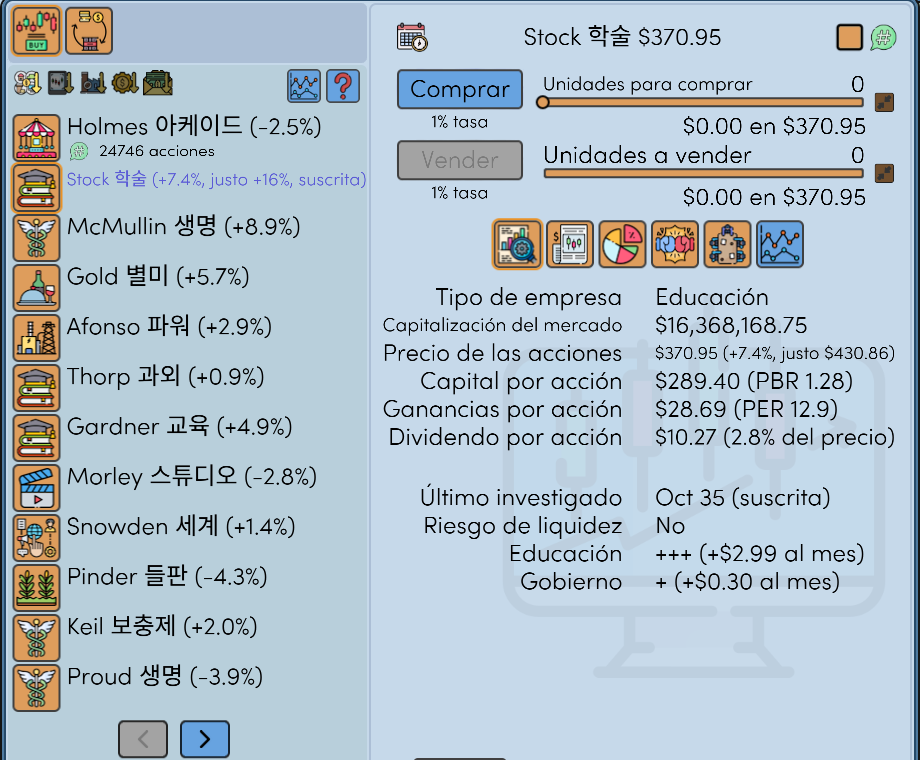
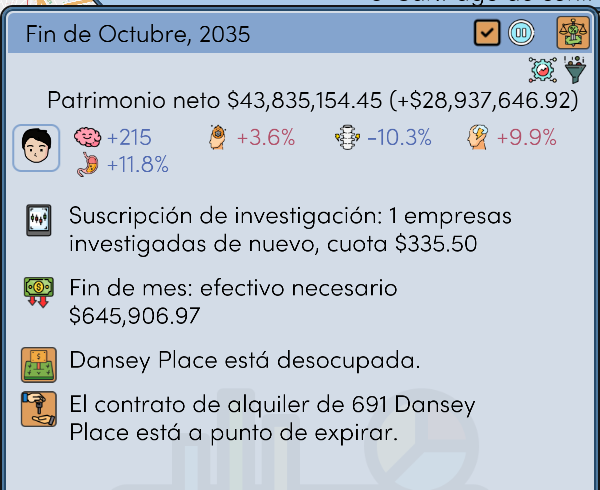
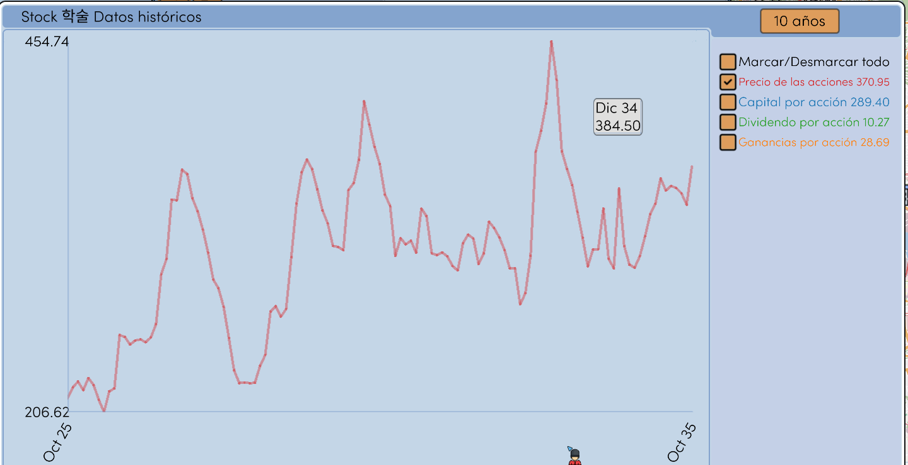
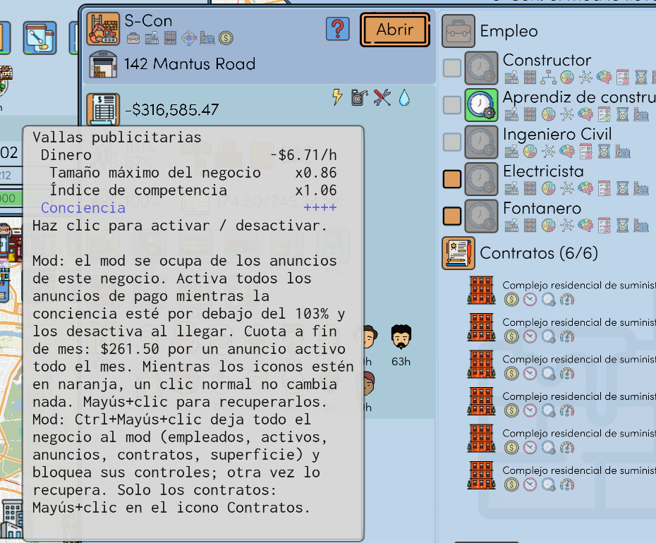
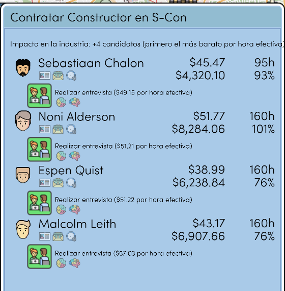

# Realistic Economy

Un mod para This Grand Life 2. Solo para la versión v1.03.22 del juego, versión 1.0.0 del mod. No es del desarrollador del juego.

Otros idiomas: [English](README.md), [한국어](README.ko.md), [Deutsch](README.de.md), [Français](README.fr.md), [Português (Brasil)](README.pt-BR.md), [日本語](README.ja.md), [简体中文](README.zh-CN.md)

## El interés de los préstamos sigue tu calificación crediticia

Interés = tipo de interés del Banco Central + un margen. La calificación crediticia de tu hogar (de AAA a B) fija el margen. Menos deuda y más ingresos y efectivo dan una calificación mejor.

## Una salida a bolsa te da efectivo

El juego te da el 25 % de las acciones y nada de efectivo. Con el mod conservas el 45 %, y el otro 55 % se vende al precio de salida. La línea pequeña bajo las tarifas muestra ese efectivo.

## Acciones: indicadores, suscripción de investigación, puestos en el Consejo

- Junto al precio de la acción: el cambio desde el mes pasado, PBR, PER y rentabilidad por dividendo.
- Con Mayús+clic en una empresa te suscribes a su investigación. El mod la investiga de nuevo cada mes, por una cuota, y muestra su precio justo. Ctrl+Mayús+clic suscribe todas las empresas.
- Cada 20 % de las acciones de una empresa cotizada garantiza un puesto en el Consejo de Administración. Nominas a un miembro de tu hogar en el mes de la elección.

El resumen mensual indica la investigación y su cuota, y el efectivo que se llevará este fin de mes.

## Gráficos

El gráfico de una empresa se abre solo con el precio de la acción. Cada línea tiene su color, y su último valor aparece junto a su nombre. El botón de tiempo ahora tiene seis meses.

## Automatización de los negocios

Empleados, activos, anuncios y contratos se pueden dejar al mod uno por uno, en cada negocio. Con Ctrl+Mayús+clic en un icono de anuncio se deja todo. Los textos de los iconos indican los clics.

La pestaña de contratación muestra primero a quien hace el mismo trabajo por menos (pago por hora ÷ eficiencia laboral).

## Fallos del juego corregidos

- El juego se cerraba después de cargar partidas unas decenas de veces
- Traducciones equivocadas en varios idiomas
- Recuadros en lugar de letras en los nombres de las personas

## Otras funciones

Cada una se puede desactivar en el archivo de configuración.

- Bloqueo de operaciones con acciones y futuros después de cargar una partida anterior
- Casino: apuesta y probabilidades fijas, cada juego una vez al mes
- Los candidatos de un mes son los mismos después de cargar
- Un aviso cuando una propiedad está en venta muy por debajo de su valor
- Una educación terminada conserva su valor

## Instalación

1. Cierra el juego.
2. Extrae el zip de [Releases](../../releases) en la carpeta del juego (donde está `TGL2.exe`).
3. Ejecuta `RealisticEconomy_install.bat`. Antes copia tus partidas a `saves_before_RealisticEconomy_1`.

Para quitar el mod, ejecuta `RealisticEconomy_uninstall.bat`. La configuración está en `RealisticEconomy.ini`. El manual completo está en inglés: [docs/RealisticEconomy_README_en.txt](docs/RealisticEconomy_README_en.txt).

Un antivirus puede avisar de `version.dll`. Es el Ultimate ASI Loader, que es público. Después de una actualización del juego, el mod se desactiva solo.

Licencia MIT. El código fuente está en [src](src).
