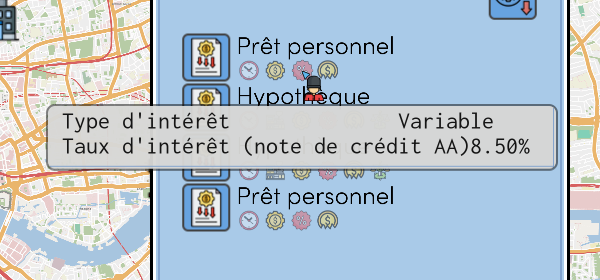
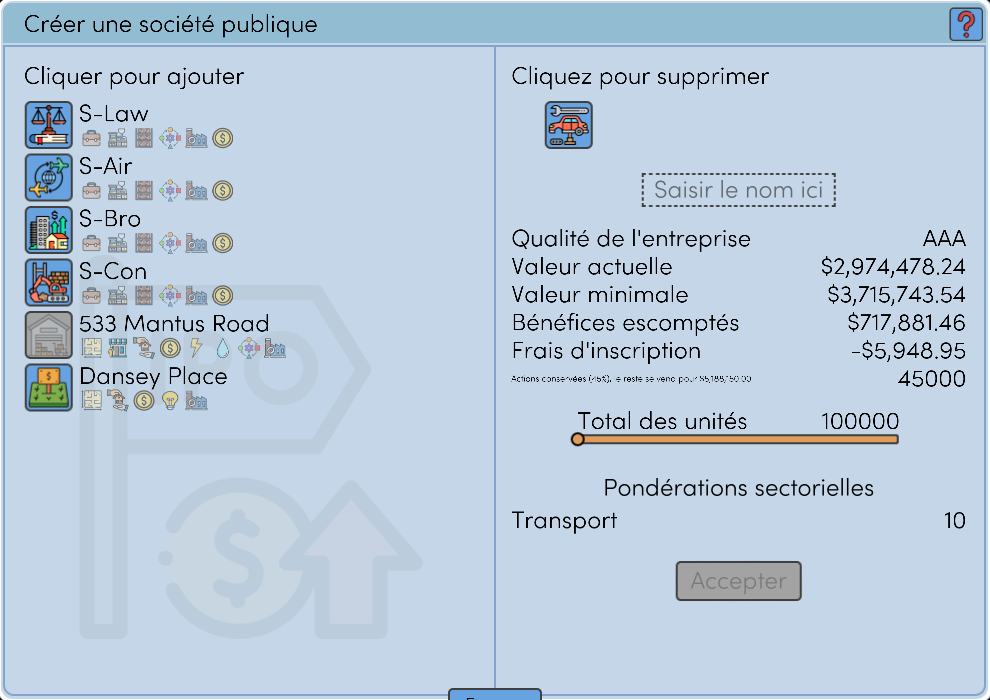
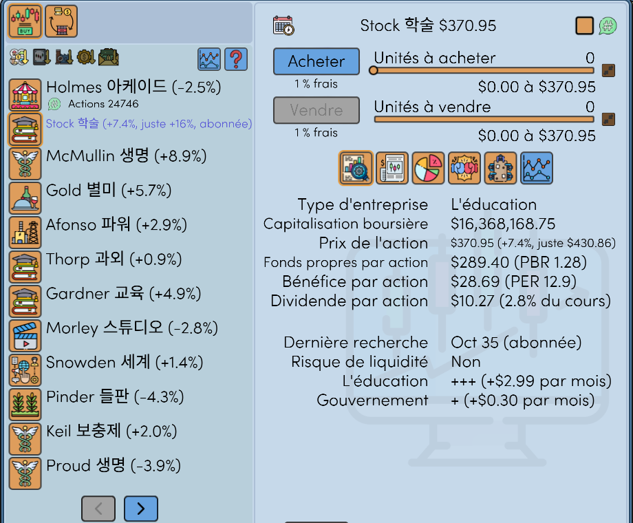
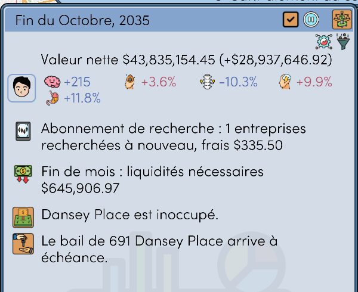
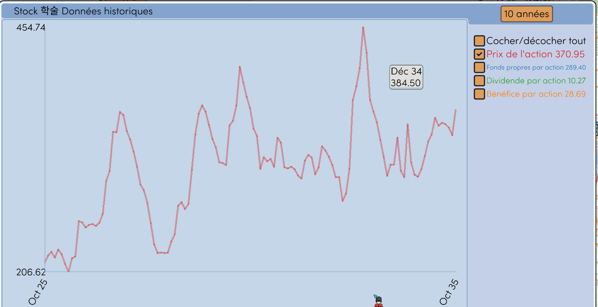
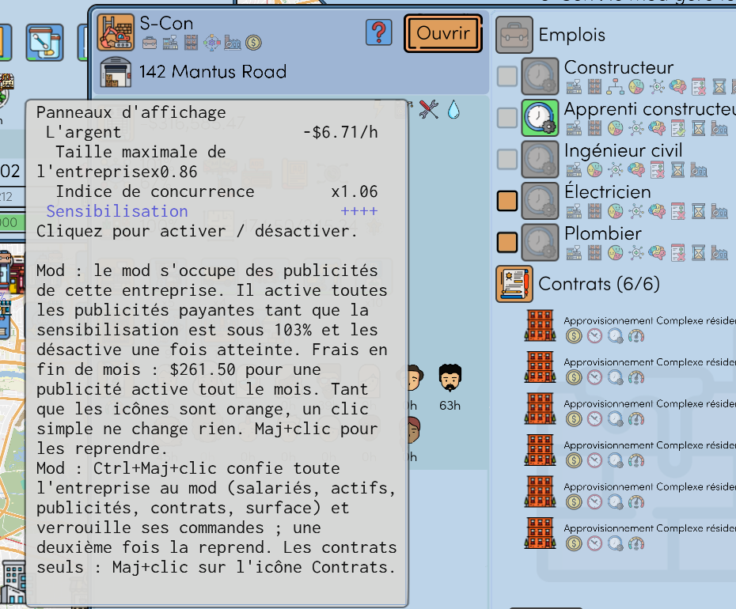
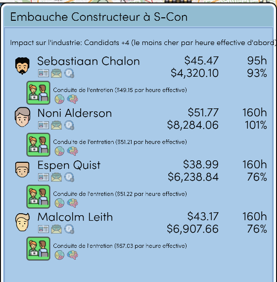

# Realistic Economy

Un mod pour This Grand Life 2. Uniquement pour la version v1.03.22 du jeu, version 1.0.0 du mod. Il n'est pas du développeur du jeu.

Autres langues : [English](README.md), [한국어](README.ko.md), [Deutsch](README.de.md), [Español](README.es.md), [Português (Brasil)](README.pt-BR.md), [日本語](README.ja.md), [简体中文](README.zh-CN.md)

## Le taux des prêts suit votre note de crédit

Taux = taux d'intérêt de la Banque centrale + une marge. La note de crédit de votre ménage (de AAA à B) fixe la marge. Moins de dette et plus de revenus et de liquidités donnent une meilleure note.

## Une introduction en bourse vous verse de l'argent

Le jeu vous donne 25 % des actions et pas d'argent. Avec le mod vous gardez 45 %, et les 55 % restants sont vendus au prix d'introduction. La petite ligne sous les frais d'inscription indique cet argent.

## Actions : indicateurs, abonnement de recherche, sièges au conseil

- À côté du cours de l'action : la variation depuis le mois dernier, PBR, PER et rendement du dividende.
- Maj+clic sur une entreprise vous abonne à sa recherche. Le mod la refait chaque mois, contre des frais, et affiche son juste prix. Ctrl+Maj+clic abonne toutes les entreprises.
- Chaque part de 20 % des actions d'une entreprise cotée garantit un siège au conseil d'administration. Vous nommez un membre de votre ménage pendant le mois de l'élection.

Le résumé mensuel indique la recherche et ses frais, ainsi que les liquidités que cette fin de mois va prendre.

## Graphiques

Le graphique d'une entreprise s'ouvre avec le seul cours de l'action. Chaque ligne a sa couleur, et sa dernière valeur s'affiche à côté de son nom. Le bouton de durée propose maintenant six mois.

## Automatisation des entreprises

Les salariés, les actifs, les publicités et les contrats peuvent être confiés au mod un par un, pour chaque entreprise. Ctrl+Maj+clic sur une icône de publicité confie tout. Les info-bulles des icônes indiquent les clics.

L'onglet d'embauche affiche d'abord celui qui fait le même travail pour moins cher (rémunération à l'heure ÷ efficacité du travail).

## Défauts du jeu corrigés

- Le jeu se fermait après quelques dizaines de chargements de sauvegarde
- Des traductions fausses dans plusieurs langues
- Des carrés à la place des lettres dans les noms des personnes

## Autres fonctions

Chacune peut être désactivée dans le fichier de réglages.

- Blocage des transactions sur actions et contrats à terme après le chargement d'une sauvegarde antérieure
- Casino : mise et chances fixes, chaque jeu une fois par mois
- Les candidats d'un mois restent les mêmes après un chargement
- Un avis quand un bien est en vente nettement sous sa valeur
- Une formation terminée garde sa valeur

## Installation

1. Fermez le jeu.
2. Extrayez le zip des [Releases](../../releases) dans le dossier du jeu (là où se trouve `TGL2.exe`).
3. Lancez `RealisticEconomy_install.bat`. Il copie d'abord vos sauvegardes dans `saves_before_RealisticEconomy_1`.

Pour retirer le mod, lancez `RealisticEconomy_uninstall.bat`. Les réglages sont dans `RealisticEconomy.ini`. Le manuel complet est en anglais : [docs/RealisticEconomy_README_en.txt](docs/RealisticEconomy_README_en.txt).

Un antivirus peut signaler `version.dll`. C'est l'Ultimate ASI Loader, qui est public. Après une mise à jour du jeu, le mod se désactive de lui-même.

Licence MIT. Le code source est dans [src](src).
