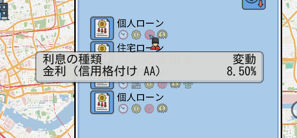
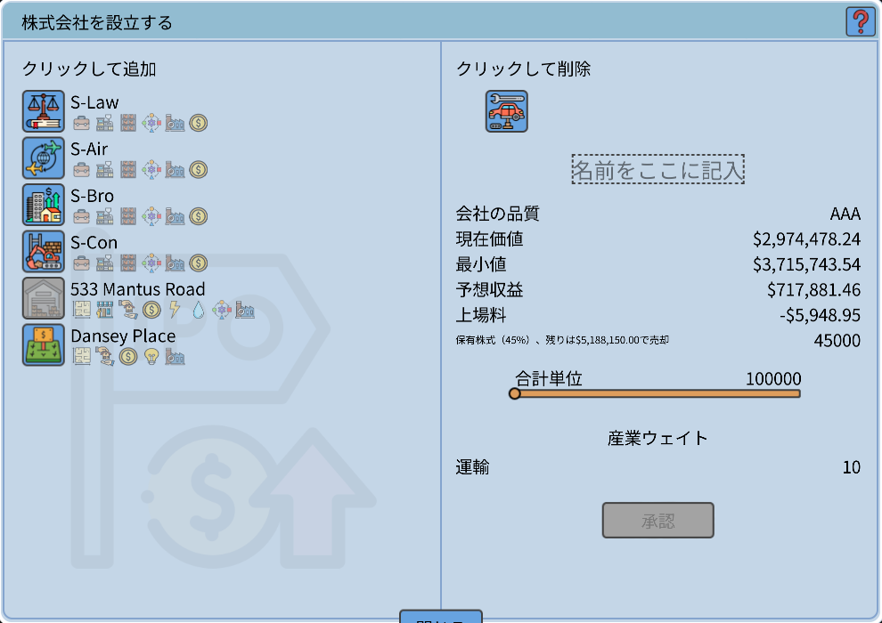
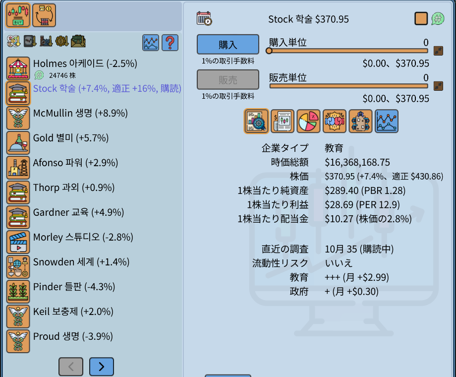
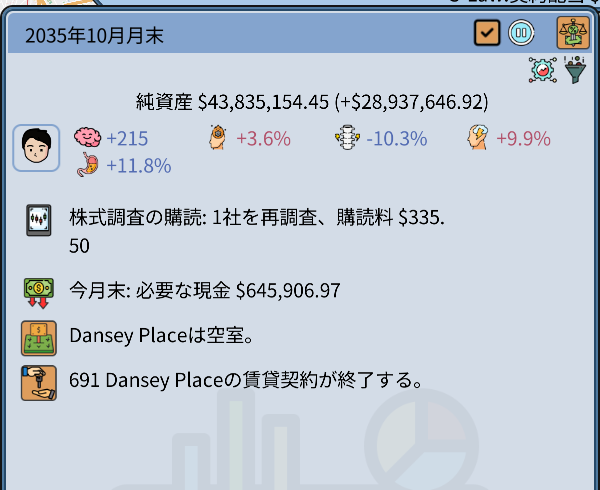
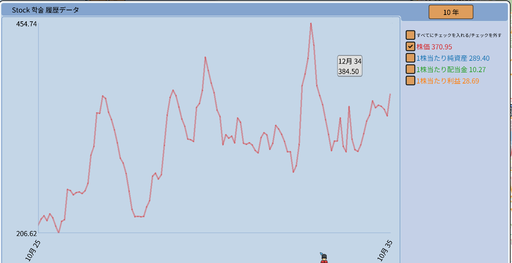
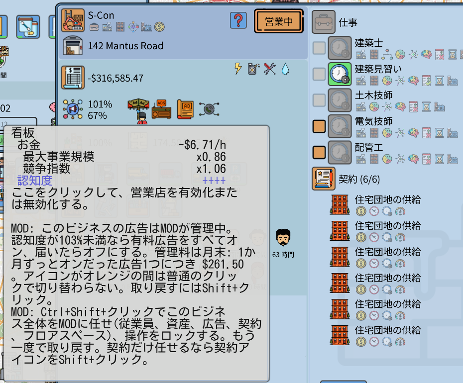
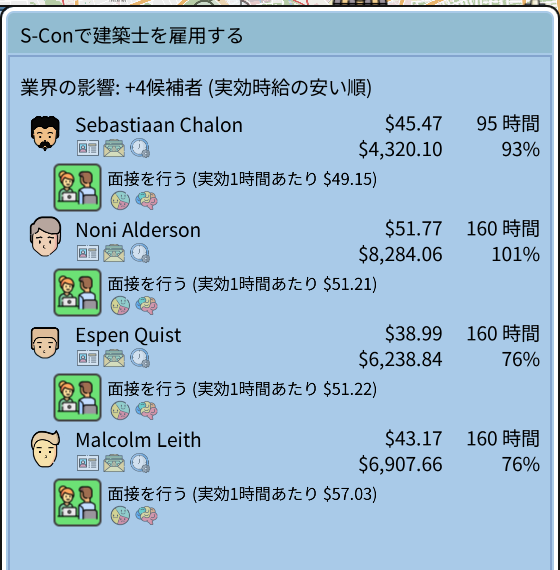

# Realistic Economy

This Grand Life 2 のMODです。ゲーム v1.03.22 専用、MODのバージョンは 1.0.0 です。ゲームの開発元が作ったものではありません。

ほかの言語: [English](README.md), [한국어](README.ko.md), [Deutsch](README.de.md), [Español](README.es.md), [Français](README.fr.md), [Português (Brasil)](README.pt-BR.md), [简体中文](README.zh-CN.md)

## ローンの金利が信用格付けで決まります

金利 = 中央銀行金利 + 上乗せ金利。上乗せ金利は世帯の信用格付け(AAA ~ B)で決まります。借金が少なく、収入と現金が多いほど格付けが良くなります。

## 上場すると現金を受け取ります

元のゲームでは株式の 25% だけを受け取り、現金はありません。MODでは 45% を持ち、残りの 55% を上場価格で売った現金を受け取ります。上場料の下の小さな行がその金額です。

## 株式: 指標、調査の購読、取締役会の席

- 株価の横に、先月からの変化率、PBR、PER、配当利回りが出ます。
- 会社を Shift+クリックすると調査を購読します。MODが手数料を取って毎月調査し直し、適正株価を表示します。Ctrl+Shift+クリックはすべての会社を購読します。
- 上場会社の株式 20% ごとに、取締役会の1席が保証されます。選挙のある月に世帯のメンバーを指名します。

調査の結果と手数料、今月末に必要な現金は月間サマリーに出ます。

## チャート

会社のチャートは株価の線だけを表示した状態で開きます。線ごとに色が違い、名前の横に最後の値が付きます。期間ボタンに6か月が加わりました。

## ビジネスの自動化

従業員、資産、広告、契約を、ビジネスごとに1つずつMODに任せられます。広告アイコンを Ctrl+Shift+クリックすると全部任せます。操作はアイコンの説明文に書いてあります。

採用タブは、同じ仕事を安くできる人から順に表示します(時給 ÷ 作業効率)。

## 直したゲームのバグ

- セーブを数十回ロードするとゲームが終了する問題
- いくつかの言語の誤った翻訳
- 人名の文字が四角で表示される問題

## そのほかの機能

設定ファイルで1つずつオフにできます。

- 前のセーブをロードしたあとの株式・先物の取引ロック
- カジノ: 決まった賭け金と確率、各ゲーム月1回
- その月の採用候補者はロードしても同じ
- 価値より大幅に安い物件が売りに出たときのお知らせ
- 修了した教育の数値は下がらない

## インストール

1. ゲームを終了します。
2. [Releases](../../releases) のzipをゲームのフォルダ(`TGL2.exe` がある場所)に展開します。
3. `RealisticEconomy_install.bat` を実行します。最初にセーブを `saves_before_RealisticEconomy_1` へコピーします。

削除するときは `RealisticEconomy_uninstall.bat` を実行します。設定は `RealisticEconomy.ini` にあります。詳しい説明書は英語です: [docs/RealisticEconomy_README_en.txt](docs/RealisticEconomy_README_en.txt)

ウイルス対策ソフトが `version.dll` を警告することがあります。公開されている Ultimate ASI Loader です。ゲームがアップデートされると、MODは自分でオフになります。

MITライセンス。ソースは [src](src) にあります。
