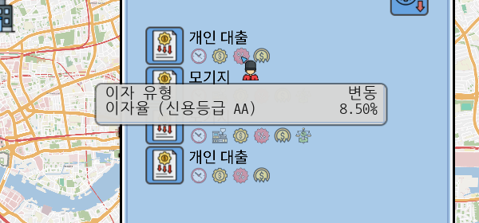
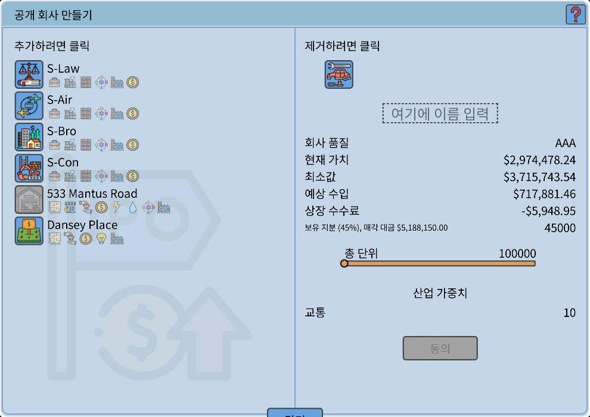
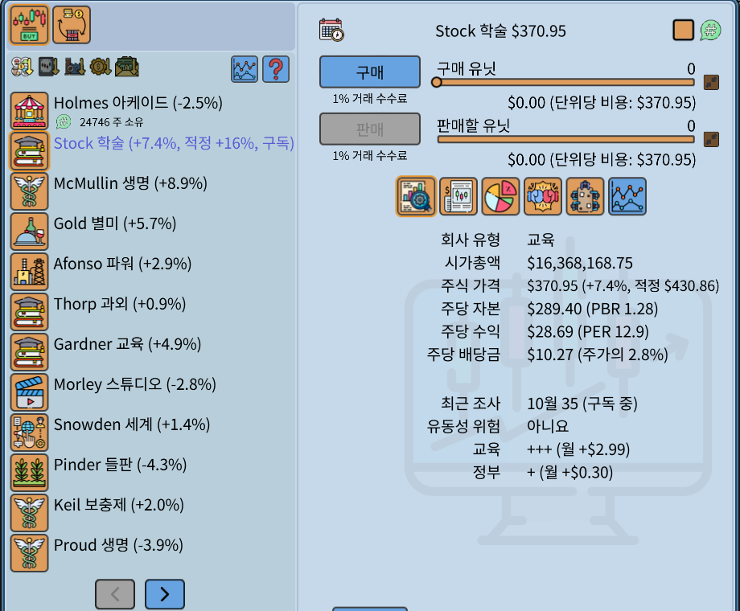
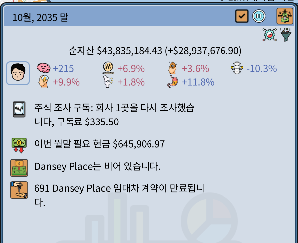
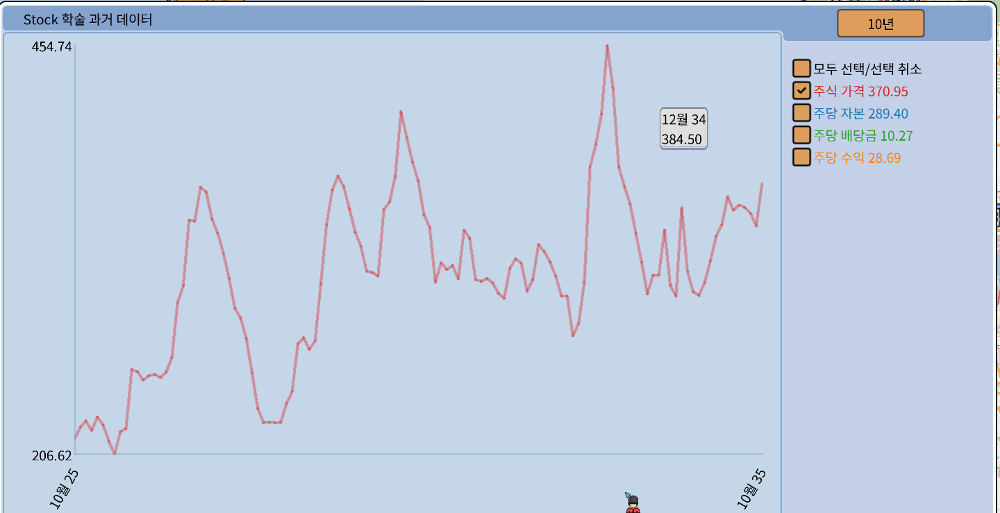
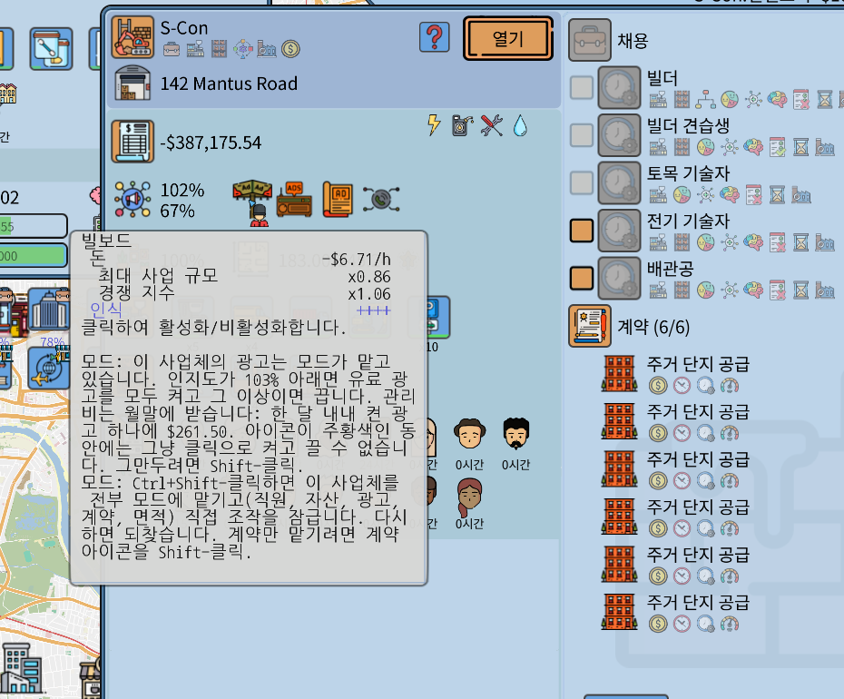
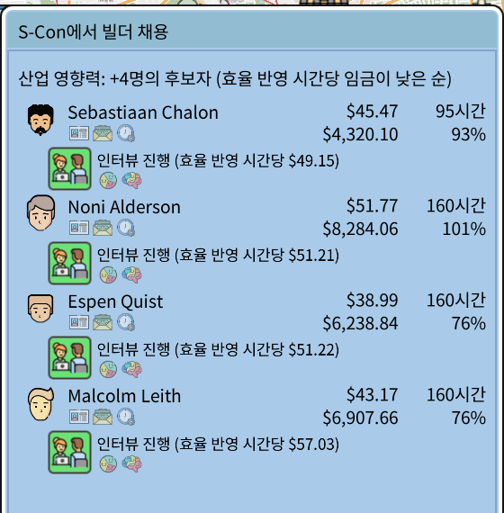

# Realistic Economy

This Grand Life 2 모드입니다. 게임 v1.03.22 전용, 모드 버전 1.0.0. 게임 제작사가 만든 것이 아닙니다.

다른 언어: [English](README.md), [Deutsch](README.de.md), [Español](README.es.md), [Français](README.fr.md), [Português (Brasil)](README.pt-BR.md), [日本語](README.ja.md), [简体中文](README.zh-CN.md)

## 대출 금리가 신용등급을 따릅니다

금리 = 중앙은행 금리 + 가산금리. 가산금리는 가계의 신용등급(AAA ~ B)이 정합니다. 빚이 적고 소득과 현금이 넉넉하면 등급이 좋아집니다.

## 상장하면 현금을 받습니다

원래 게임은 주식의 25% 만 주고 현금은 주지 않습니다. 모드에서는 45% 를 갖고 나머지 55% 를 상장가에 판 돈을 받습니다. 상장 수수료 아래의 작은 줄이 그 금액입니다.

## 주식: 지표, 조사 구독, 이사회 자리

- 주가 옆에 지난달 대비 변동률, PBR, PER, 배당수익률이 나옵니다.
- 회사를 Shift-클릭하면 조사를 구독합니다. 모드가 수수료를 받고 달마다 다시 조사해서 적정 주가를 보여 줍니다. Ctrl+Shift-클릭은 모든 회사를 구독합니다.
- 상장 회사의 주식 20% 마다 이사회 한 자리가 보장됩니다. 선거가 있는 달에 가계 구성원을 지명하면 됩니다.

조사 결과와 수수료, 이번 월말에 나갈 현금은 월간 요약에 나옵니다.

## 차트

회사 차트는 주가 선만 켠 채로 열립니다. 선마다 색이 다르고 이름 옆에 마지막 값이 붙습니다. 기간 버튼에 6개월이 생겼습니다.

## 사업체 자동화

직원, 자산, 광고, 계약을 사업체마다 하나씩 모드에 맡길 수 있습니다. 광고 아이콘을 Ctrl+Shift-클릭하면 전부 맡깁니다. 누르는 법은 아이콘의 설명 글에 나옵니다.

채용 창은 같은 일을 싸게 하는 사람부터 보여 줍니다(시간당 임금 ÷ 업무 효율).

## 고친 게임 버그

- 세이브를 수십 번 불러오면 게임이 꺼지던 문제
- 틀린 번역(고정 금리가 "수정됨"으로 나오던 것 등. 다른 언어도 고쳤습니다)
- 사람 이름의 글자가 네모로 나오던 문제

## 그 밖의 기능

설정 파일에서 하나씩 끌 수 있습니다.

- 예전 세이브를 불러온 뒤의 주식·선물 거래 잠금
- 카지노: 정해진 판돈과 확률, 게임마다 한 달에 한 번
- 그 달의 채용 지원자는 불러와도 그대로
- 가치보다 많이 싼 부동산이 나오면 알림
- 마친 교육은 수치가 깎이지 않음

## 설치

1. 게임을 끕니다.
2. [Releases](../../releases) 의 zip 을 게임 폴더(`TGL2.exe` 가 있는 곳)에 풉니다.
3. `RealisticEconomy_install.bat` 을 실행합니다. 세이브를 먼저 `saves_before_RealisticEconomy_1` 에 복사해 둡니다.

지울 때는 `RealisticEconomy_uninstall.bat` 을 실행합니다. 설정은 `RealisticEconomy.ini` 에 있습니다. 자세한 설명서는 [docs/RealisticEconomy_README_ko.txt](docs/RealisticEconomy_README_ko.txt) 입니다.

백신이 `version.dll` 을 의심할 수 있습니다. 공개된 Ultimate ASI Loader 입니다. 게임이 업데이트되면 모드는 스스로 꺼집니다.

MIT 라이선스. 소스는 [src](src) 에 있습니다.
