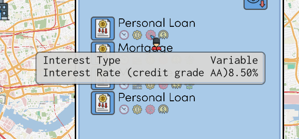
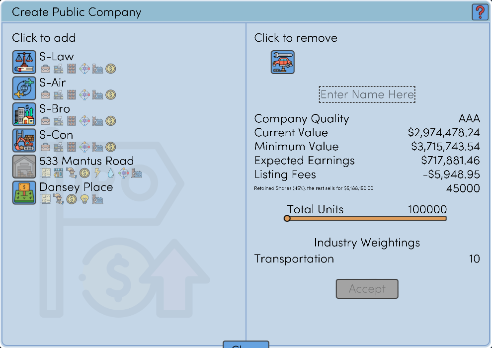
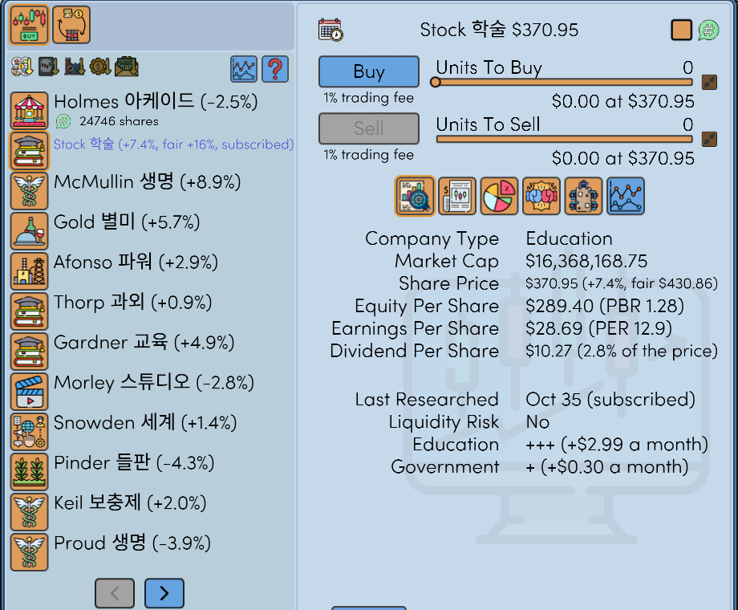
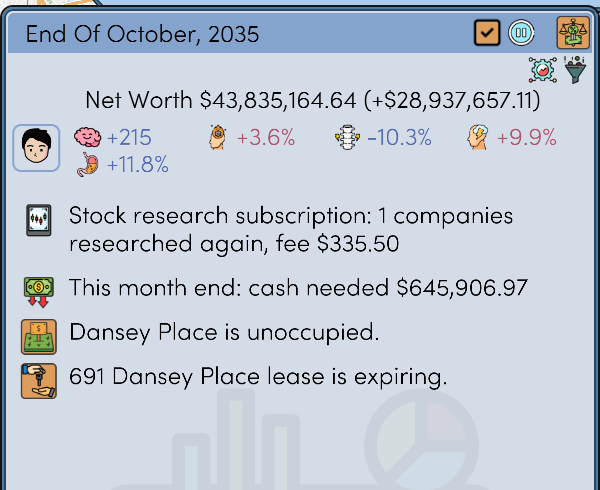
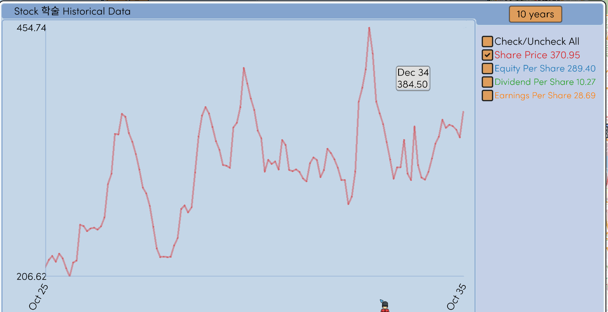
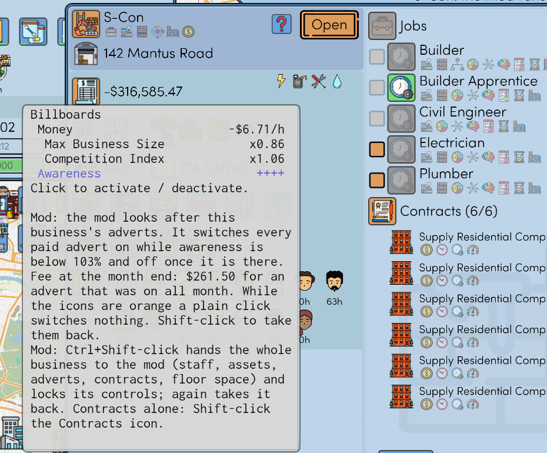
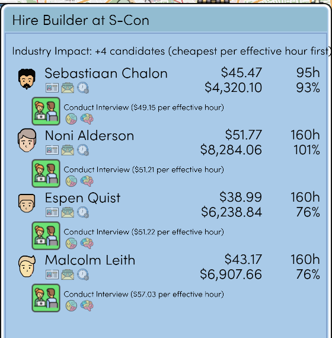

# Realistic Economy

A mod for This Grand Life 2. Game v1.03.22 only, mod version 1.1.0. Not made by the game's developer.

Other languages: [한국어](README.ko.md), [Deutsch](README.de.md), [Español](README.es.md), [Français](README.fr.md), [Português (Brasil)](README.pt-BR.md), [日本語](README.ja.md), [简体中文](README.zh-CN.md)

## Loan interest follows your credit grade

Rate = central bank rate + a margin. Your household's credit grade (AAA to B) sets the margin. Less debt and more income and cash give a better grade.

## An IPO pays you cash

The game gives you 25% of the shares and no cash. With the mod you keep 45%, and the other 55% is sold at the listing price. The small line under the listing fee shows that cash.

## Stocks: ratios, research subscription, board seats

- Next to the share price: the change from last month, PBR, PER and dividend yield.
- Shift-click a company to subscribe to its research. The mod researches it again every month, for a fee, and shows its fair price. Ctrl+Shift-click subscribes every company.
- Every 20% of a listed company's shares guarantees one board seat. You nominate a household member in the month of the election.

The monthly summary reports the research and its fee, and the cash this month end will take.

## Charts

A company's chart opens with the share price alone. Each line has its own colour, and its last value stands next to its name. The time button now has six months.

## Business automation

Staff, assets, adverts and contracts can be handed to the mod one by one, for each business. Ctrl+Shift-click an advert icon to hand over everything. The icons' hover texts tell you the clicks.

The hire tab lists first who does the same work for less (pay per hour ÷ work efficiency).

## Game bugs fixed

- The game shutting down after a few dozen loads of a save
- Wrong translations in several languages
- Boxes in place of letters in people's names

## Other features

Each can be switched off in the settings file.

- Trade lock for shares and futures after you load an earlier save
- The month's economic growth, share prices, listing price and properties for sale stay the same after a load
- Casino: set stakes and odds, each game once a month
- The month's job candidates stay the same after a load
- A notice when a property is for sale well under its value
- A completed education keeps its value

## Install

1. Close the game.
2. Extract the zip from [Releases](../../releases) into the game folder (where `TGL2.exe` is).
3. Run `RealisticEconomy_install.bat`. It copies your saves to `saves_before_RealisticEconomy_1` first.

To remove the mod, run `RealisticEconomy_uninstall.bat`. The settings are in `RealisticEconomy.ini`. The full manual is [docs/RealisticEconomy_README_en.txt](docs/RealisticEconomy_README_en.txt).

An antivirus may flag `version.dll`. It is the public Ultimate ASI Loader. After a game update the mod switches itself off.

MIT licence. The source is in [src](src).
