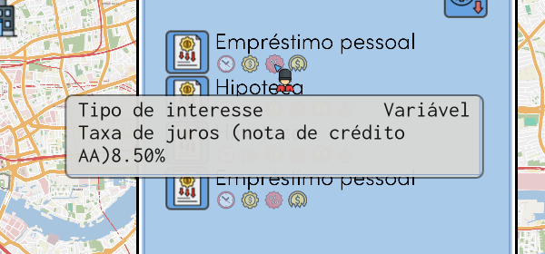
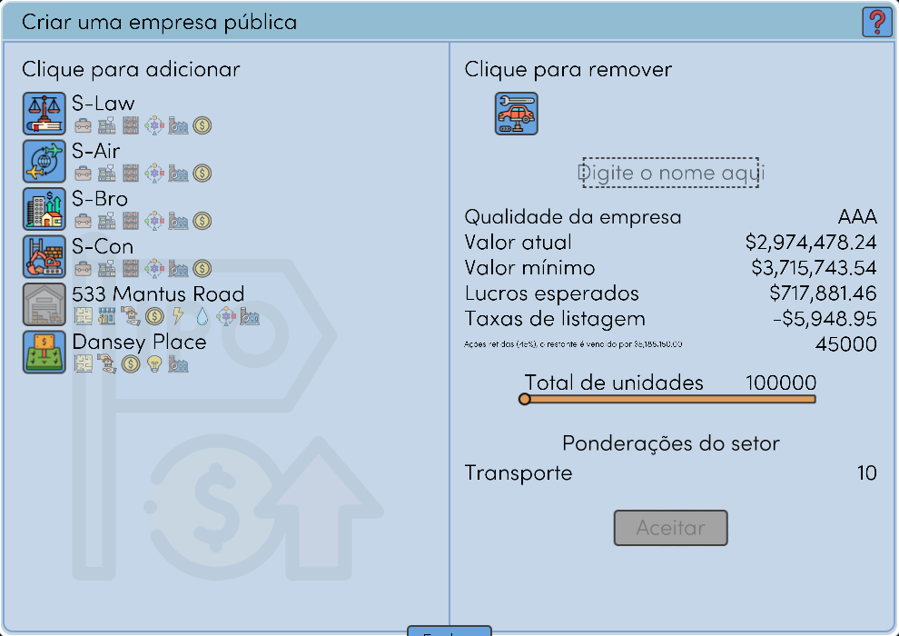
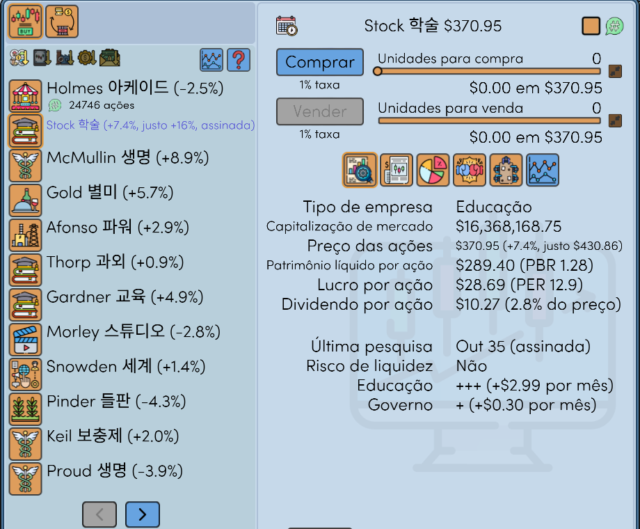
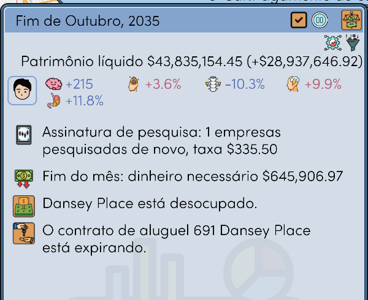
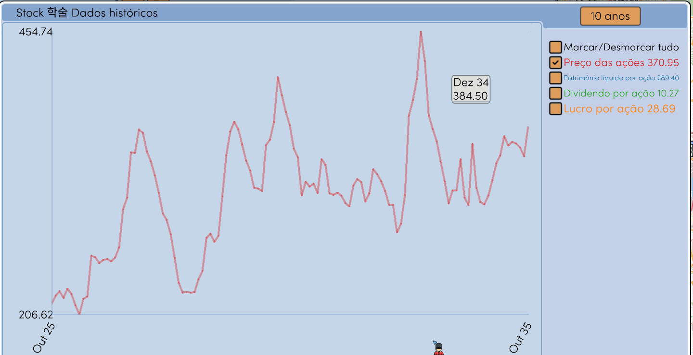
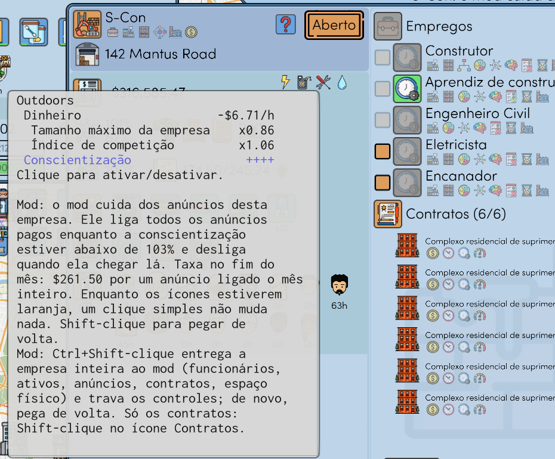
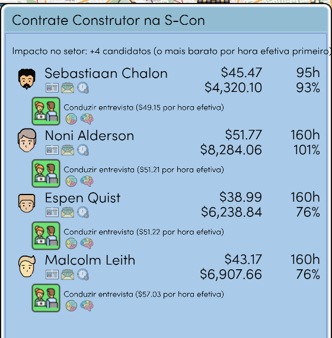

# Realistic Economy

Um mod para This Grand Life 2. Somente para a versão v1.03.22 do jogo, versão 1.0.0 do mod. Não é do desenvolvedor do jogo.

Outros idiomas: [English](README.md), [한국어](README.ko.md), [Deutsch](README.de.md), [Español](README.es.md), [Français](README.fr.md), [日本語](README.ja.md), [简体中文](README.zh-CN.md)

## Os juros dos empréstimos seguem a sua nota de crédito

Juros = taxa de juros do Banco Central + uma margem. A nota de crédito da sua família (de AAA a B) define a margem. Menos dívida e mais renda e dinheiro dão uma nota melhor.

## Uma abertura de capital paga em dinheiro

O jogo dá a você 25% das ações e nenhum dinheiro. Com o mod você fica com 45%, e os outros 55% são vendidos ao preço de abertura. A linha pequena abaixo das taxas de listagem mostra esse dinheiro.

## Ações: indicadores, assinatura de pesquisa, cadeiras no Conselho

- Ao lado do preço da ação: a variação desde o mês passado, PBR, PER e rendimento do dividendo.
- Shift-clique em uma empresa assina a pesquisa dela. O mod pesquisa a empresa de novo todo mês, por uma taxa, e mostra o preço justo. Ctrl+Shift-clique assina todas as empresas.
- Cada 20% das ações de uma empresa listada garante uma cadeira no Conselho de Administração. Você indica um membro da família no mês da eleição.

O resumo mensal informa a pesquisa e a taxa dela, e o dinheiro que este fim de mês vai levar.

## Gráficos

O gráfico de uma empresa abre só com o preço da ação. Cada linha tem a sua cor, e o último valor aparece ao lado do nome. O botão de tempo agora tem seis meses.

## Automação das empresas

Funcionários, ativos, anúncios e contratos podem ser entregues ao mod um a um, em cada empresa. Ctrl+Shift-clique em um ícone de anúncio entrega tudo. Os textos dos ícones informam os cliques.

A aba de contratação mostra primeiro quem faz o mesmo trabalho por menos (pagamento por hora ÷ eficiência no trabalho).

## Falhas do jogo corrigidas

- O jogo fechava depois de carregar jogos salvos algumas dezenas de vezes
- Traduções erradas em vários idiomas
- Quadradinhos no lugar das letras nos nomes das pessoas

## Outras funções

Cada uma pode ser desligada no arquivo de configurações.

- Bloqueio de negociação de ações e futuros depois de carregar um jogo salvo anterior
- Cassino: aposta e chances fixas, cada jogo uma vez por mês
- Os candidatos de um mês continuam os mesmos depois de carregar
- Um aviso quando um imóvel está à venda bem abaixo do valor
- Uma formação concluída mantém o valor

## Instalação

1. Feche o jogo.
2. Extraia o zip de [Releases](../../releases) na pasta do jogo (onde está `TGL2.exe`).
3. Execute `RealisticEconomy_install.bat`. Antes ele copia seus jogos salvos para `saves_before_RealisticEconomy_1`.

Para remover o mod, execute `RealisticEconomy_uninstall.bat`. As configurações estão em `RealisticEconomy.ini`. O manual completo está em inglês: [docs/RealisticEconomy_README_en.txt](docs/RealisticEconomy_README_en.txt).

Um antivírus pode alertar sobre `version.dll`. É o Ultimate ASI Loader, que é público. Depois de uma atualização do jogo, o mod se desliga sozinho.

Licença MIT. O código-fonte está em [src](src).
