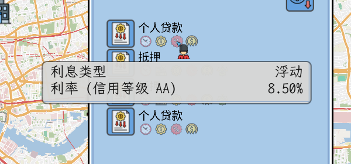
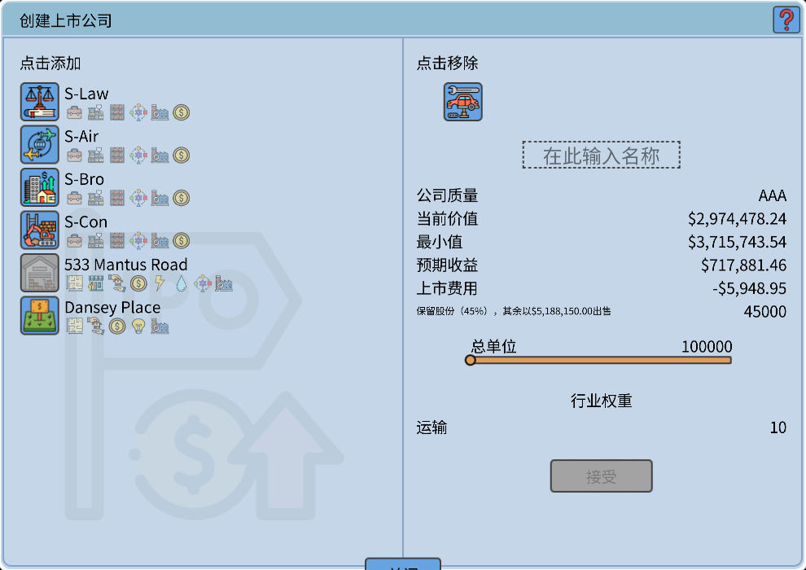
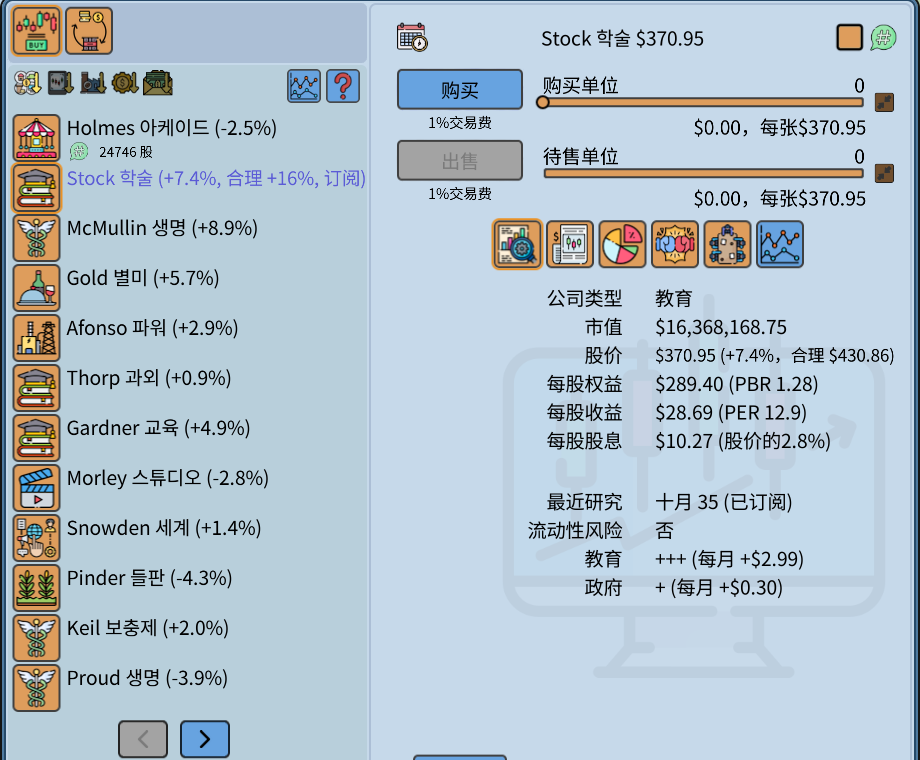
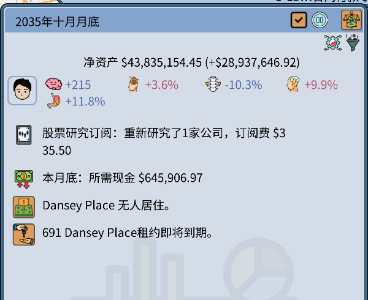
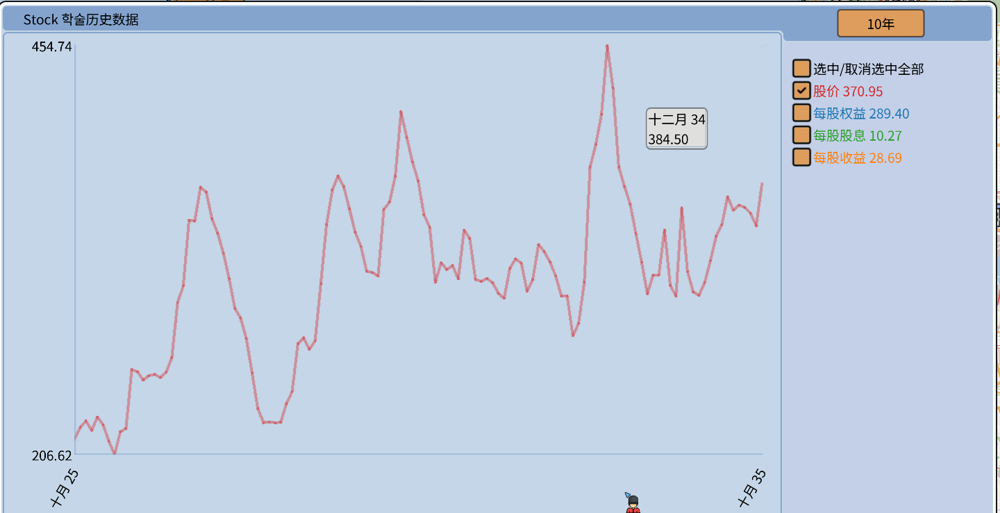
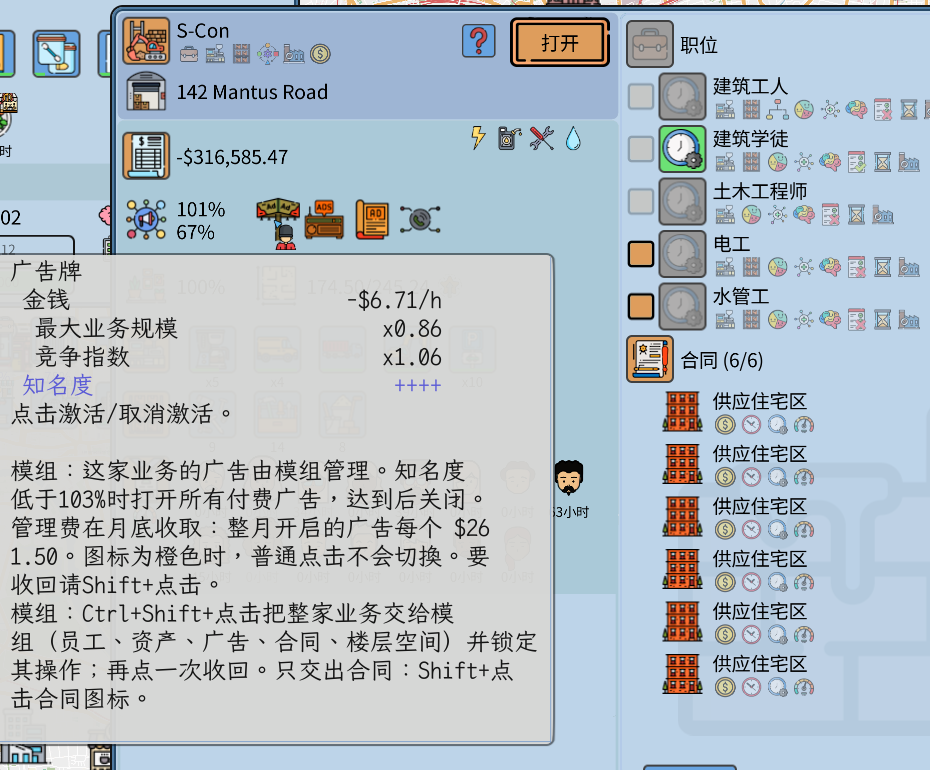
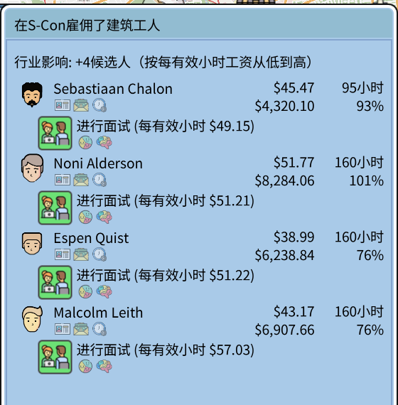

# Realistic Economy

This Grand Life 2 的模组。仅适用于游戏 v1.03.22，模组版本 1.1.0。不是游戏开发商制作的。

其他语言：[English](README.md)、[한국어](README.ko.md)、[Deutsch](README.de.md)、[Español](README.es.md)、[Français](README.fr.md)、[Português (Brasil)](README.pt-BR.md)、[日本語](README.ja.md)

## 贷款利率取决于信用等级

利率 = 中央银行利率 + 加点。加点由家庭的信用等级（AAA 到 B）决定。债务少、收入和现金多，等级就高。

## 上市可以拿到现金

原版游戏只给你 25% 的股份，没有现金。使用模组后你保留 45%，其余 55% 按上市价卖出，现金归你。上市费用下面的小字一行就是这笔钱。

## 股票：指标、研究订阅、董事会席位

- 股价旁边显示较上月的变化、PBR、PER 和股息率。
- Shift+点击一家公司即可订阅它的研究。模组每月收费重新研究，并显示合理股价。Ctrl+Shift+点击订阅所有公司。
- 一家上市公司每 20% 的股份保证一个董事会席位。在选举的那个月提名一名家庭成员即可。

研究的结果和费用，以及本月底需要的现金，都显示在每月总结里。

## 图表

公司的图表打开时只显示股价线。每条线颜色不同，名称旁边带有最新数值。时间按钮增加了 6 个月。

## 业务自动化

员工、资产、广告和合同，可以按业务逐项交给模组。Ctrl+Shift+点击广告图标可以全部交出。操作方法写在图标的说明文字里。

招聘标签页先显示用更低成本做同样工作的人（每小时工资 ÷ 工作效率）。

## 修复的游戏问题

- 读取存档几十次后游戏会关闭
- 多种语言里的翻译错误
- 人名中的字母显示成方框

## 其他功能

每一项都可以在设置文件里关闭。

- 读取以前的存档后锁定股票和期货交易
- 当月的经济增长率、股价、上市价和在售房产读档后不变
- 赌场：固定的赌注和概率，每种游戏每月一次
- 当月的求职候选人读档后不变
- 有房产以远低于价值的价格出售时给出提示
- 已完成的教育数值不会降低

## 安装

1. 关闭游戏。
2. 把 [Releases](../../releases) 里的 zip 解压到游戏文件夹（`TGL2.exe` 所在的位置）。
3. 运行 `RealisticEconomy_install.bat`。它会先把你的存档复制到 `saves_before_RealisticEconomy_1`。

要移除模组，请运行 `RealisticEconomy_uninstall.bat`。设置在 `RealisticEconomy.ini` 里。完整的说明书是英文的：[docs/RealisticEconomy_README_en.txt](docs/RealisticEconomy_README_en.txt)

杀毒软件可能会对 `version.dll` 报警。它是公开的 Ultimate ASI Loader。游戏更新后，模组会自行关闭。

MIT 许可证。源代码在 [src](src) 里。
